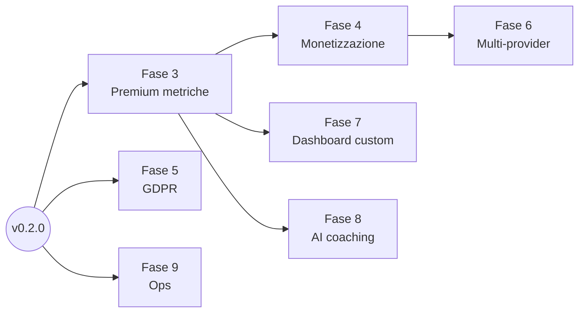

# PEMIQ — Fasi di sviluppo future

Documento di pianificazione aggiornato alla release **v0.2.0** (2026-06-14).  
Le fasi 0, 1 e 2 sono completate — vedi `docs/project/done.md`.

---

## Stato attuale del codice (v0.2.0)

### Infrastruttura

| Area | Stato | Note |
|------|-------|------|
| Docker local / UAT / Production | ✅ | |
| Queue + Scheduler | ✅ | Sync incrementale ogni ora |

### Autenticazione e utenti

| Area | Stato | Note |
|------|-------|------|
| Registrazione + verifica email | ✅ | |
| Login / logout + throttling | ✅ | |
| Reset e cambio password | ✅ | |
| Profilo utente + locale IT/EN | ✅ | |
| Ruoli Spatie | ✅ | `administrator`, `user` |
| Premium (campi DB + admin + badge) | ✅ | |
| Middleware `EnsurePremium` | ✅ | Applicato a `/premium/*` |

### Integrazione Strava

| Area | Stato | Note |
|------|-------|------|
| OAuth collega / scollega | ✅ | |
| Token refresh + UX token scaduto | ✅ | Messaggio distinto da "mai collegato" |
| Sync storica / incrementale | ✅ | |
| Notifiche email sync fallita / token scaduto | ✅ | |
| Cifratura token | ✅ | Cast encrypted su `StravaAccount` |

### Dashboard utente

| Area | Stato | Note |
|------|-------|------|
| Overview stats | ✅ | |
| Grafici ApexCharts (annuale, mensile, sport) | ✅ | |
| Lista attività con filtri e paginazione | ✅ | |
| Dettaglio attività con mappa Leaflet.js | ✅ | |
| Stato sync in tempo reale (polling 5s) | ✅ | |
| i18n completa IT/EN | ✅ | |
| Landing page pubblica | ✅ | |

### Premium

| Area | Stato | Note |
|------|-------|------|
| Gating middleware | ✅ | |
| Trend analysis (linea/area) | ✅ | |
| Confronto periodi (KPI + grafico + tabella) | ✅ | |
| Confronto anno su anno | ✅ | |
| Pagina /premium placeholder | ✅ | |
| Monetizzazione Stripe | ❌ | Fase 4 |

### Backoffice Filament

| Area | Stato | Note |
|------|-------|------|
| UserResource, StravaAccount, Activity, SyncLog, AuditLog | ✅ | |
| Impersonificazione + audit | ✅ | |
| Rilancio job falliti da UI | ❌ | Fase 9 |

### Qualità e test

| Area | Stato | Note |
|------|-------|------|
| Test auth, OAuth Strava | ✅ | |
| Test sync job storica / incrementale | ✅ | |
| Test impersonificazione, EnsurePremium, DashboardStatsService, TrendAnalysisService | ✅ | |
| Test backoffice Filament | ❌ | |

---

## Principi di suddivisione

Le fasi seguenti sono ordinate per **valore utente**, **dipendenze tecniche** e **rischio**.

---

## Fase 3 — Premium: personal records, training load e metriche avanzate

**Obiettivo:** completare il pacchetto Premium descritto nel PRD §4.

**Dipende da:** v0.2.0 (Fase 2 completata)

### Deliverable

- [ ] **Personal records**
  - Rilevamento automatico PR per distanza (5k, 10k, mezza, maratona, custom), velocità, dislivello, HR
  - Storico PR con data e link all'attività
  - Job o calcolo on-demand con cache
- [ ] **Training load**
  - Carico settimanale/mensile basato su tempo, distanza o TRIMP semplificato
  - Grafico andamento carico + alert soglia (sovraccarico / sotto-allenamento)
- [ ] **Performance metrics**
  - Metriche aggregate avanzate dove i dati lo consentono (HR, watt)
  - Gestione null-safe esplicita (rischio R-6 del PRD)
- [ ] **Migration opzionale**
  - Tabella `personal_records` o materialized stats per evitare ricalcolo costoso

### Definition of Done

Utente Premium con ≥1 anno di attività vede PR, carico allenante e metriche avanzate coerenti con i dati Strava importati.

**Stima indicativa:** 4–5 settimane

---

## Fase 4 — Monetizzazione Stripe

**Obiettivo:** passare dalla promozione Premium manuale al self-service a pagamento (PRD §17, v1.1).

**Dipende da:** Fase 3

### Deliverable

- [ ] Integrazione **Laravel Cashier** o Stripe SDK diretto
- [ ] Piani mensile/annuale configurabili via env
- [ ] Checkout, customer portal, gestione carte
- [ ] Webhook Stripe → aggiornamento `is_premium`, `premium_started_at`, `premium_expires_at`
- [ ] Pagina `/premium` aggiornata con pricing e checkout (sostituisce il placeholder statico)
- [ ] Grace period e downgrade automatico a scadenza
- [ ] Fatturazione e ricevute (Stripe-hosted)
- [ ] Test con Stripe test mode + webhook locale (Stripe CLI)

### Definition of Done

Un utente Free può sottoscrivere Premium senza intervento admin; la scadenza e il rinnovo sono gestiti automaticamente.

**Stima indicativa:** 2–3 settimane

---

## Fase 5 — GDPR e diritti dell'utente

**Obiettivo:** conformità NFR-6 e fiducia utente, prerequisito per crescita in UE.

**Dipende da:** v0.2.0 (può partire in parallelo)

### Deliverable

- [ ] **Export dati personali**
  - Job asincrono che genera ZIP (profilo, attività, sync logs) in JSON/CSV
  - Download link temporaneo
- [ ] **Cancellazione account**
  - Flow confermato con password
  - Cascade delete attività, strava_account, sync_logs (audit_logs anonimizzati)
  - Revoca token Strava prima della cancellazione
- [ ] **Privacy policy e consensi**
  - Pagine legali statiche
  - Checkbox consenso in registrazione se richiesto
- [ ] **Retention policy**
  - Documentazione e eventuale purge automatica log vecchi

### Definition of Done

Utente può esportare e cancellare il proprio account end-to-end; procedura documentata per richieste DPA.

**Stima indicativa:** 2 settimane

---

## Fase 6 — Architettura multi-provider

**Obiettivo:** estendere oltre Strava senza refactoring invasivo (PRD rischio R-5, NFR-9).

**Dipende da:** Fase 4

### Deliverable

- [ ] **Interfaccia `IntegrationProviderInterface`**
  - Metodi: `connect`, `disconnect`, `refreshToken`, `fetchActivities`, `getAthleteId`
- [ ] **Refactor sync**
  - `ActivitySyncService` agnostico dal provider
  - Tabella `integration_accounts` generica (o STI) al posto di `strava_accounts`-only
  - `activities.provider` + `activities.external_id` (migrazione da `strava_activity_id`)
- [ ] **Primo provider aggiuntivo**
  - Candidato: **import GPX manuale** (nessuna OAuth, valida l'architettura)
  - Oppure Garmin Connect (OAuth più complesso)
- [ ] **UI collegamento multiplo**
  - Sezione "Integrazioni" nel profilo
- [ ] **Deduplicazione cross-provider** (se stessa attività importata due volte)

### Definition of Done

Un utente può importare attività da Strava e da almeno una seconda fonte; le dashboard aggregano tutte le fonti.

**Stima indicativa:** 5–6 settimane (dipende dal provider scelto)

---

## Fase 7 — Dashboard personalizzabili

**Obiettivo:** differenziazione Premium avanzata (PRD §4).

**Dipende da:** Fase 3

### Deliverable

- [ ] Modello `dashboard_layouts` (user_id, widgets JSON, ordine, nome vista)
- [ ] Catalogo widget riusabili (overview, trend, PR, training load, sport distribution)
- [ ] Editor drag-and-drop o configurazione semplice Livewire
- [ ] Viste salvate e vista predefinita
- [ ] (Opzionale) Condivisione vista read-only via link

### Definition of Done

Utente Premium crea, salva e ripristina layout dashboard personalizzati.

**Stima indicativa:** 3–4 settimane

---

## Fase 8 — AI coaching (esplorativa)

**Obiettivo:** posizionamento futuro descritto nella Product Vision.

**Nota:** fase ad alto rischio/incertezza; conviene iniziare con POC interno dopo Fase 3 (dati metriche ricchi).

**Dipende da:** Fase 3

### Deliverable (MVP AI)

- [ ] Integrazione LLM (Claude API via Anthropic SDK — modello consigliato: claude-sonnet-4-6)
- [ ] Prompt con contesto attività recenti + carico allenante
- [ ] Chat o report settimanale automatico ("cosa è andato bene / cosa migliorare")
- [ ] Rate limit e cost control per utente Premium
- [ ] Disclaimer medico/sportivo

### Definition of Done

Utente Premium riceve un insight testuale settimanale basato sui propri dati reali, con latenza accettabile e costi monitorati.

**Stima indicativa:** 4+ settimane (spike iniziale 1 settimana)

---

## Fase 9 — Operazioni, observability e scalabilità

**Obiettivo:** sostenere crescita utenti post-lancio pubblico. Può partire in parallelo.

**Dipende da:** v0.2.0 (parallelo)

### Deliverable

- [ ] **Monitoraggio errori** (Sentry o equivalente) su app + queue
- [ ] **Health checks** e alert su queue worker / scheduler
- [ ] **Cache aggregazioni dashboard** in Redis (TTL configurabile per utente)
- [ ] **Rilancio job falliti** da Filament (`SyncLogResource` → action "Retry")
- [ ] **Backup DB automatici** giornalieri in production
- [ ] **Horizon** (opzionale) per visibilità queue Redis

### Definition of Done

Team ops riceve alert su sync fallite e errori 5xx; dashboard resta <2s p95 con cache attiva.

**Stima indicativa:** 2–3 settimane (incrementale)

---

## Riepilogo timeline indicativa

| Fase | Nome | Durata stimata | Dipende da |
|------|------|----------------|------------|
| 3 | Premium: PR e training load | 4–5 sett. | v0.2.0 |
| 4 | Monetizzazione Stripe | 2–3 sett. | 3 |
| 5 | GDPR | 2 sett. | v0.2.0 (parallelo) |
| 6 | Multi-provider | 5–6 sett. | 4 |
| 7 | Dashboard personalizzabili | 3–4 sett. | 3 |
| 8 | AI coaching | 4+ sett. | 3 |
| 9 | Ops e infrastruttura | 2–3 sett. | v0.2.0 (parallelo) |

**Totale indicativo verso prodotto Premium completo + pagamenti:** ~4–6 mesi con un developer full-time.

---

## Debito tecnico da tenere d'occhio

| Item | Impatto | Quando affrontare |
|------|---------|-------------------|
| Sync Strava-specifica ovunque | Alto (estensibilità) | Fase 6 |
| `strava_activity_id` UNIQUE globale | Basso | Fase 6 (multi-provider) |
| Nessun test backoffice Filament | Medio | Fase 3 o 9 |
| Cache aggregazioni dashboard assente | Medio (performance) | Fase 9 |
| Rilancio job falliti da UI mancante | Basso | Fase 9 |

---

*Documento aggiornato il 2026-06-14 alla release v0.2.0.*
